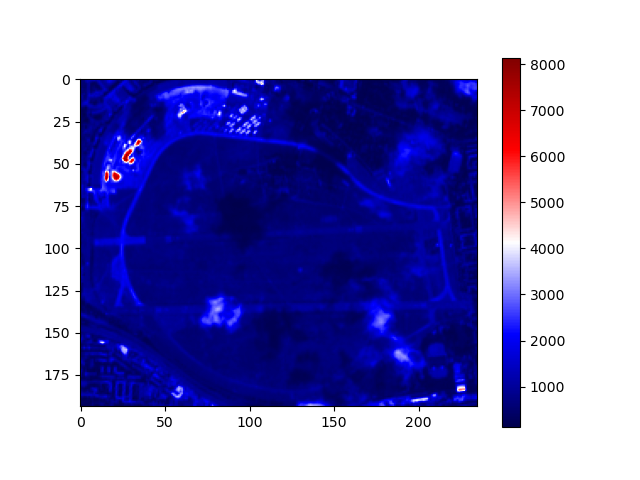
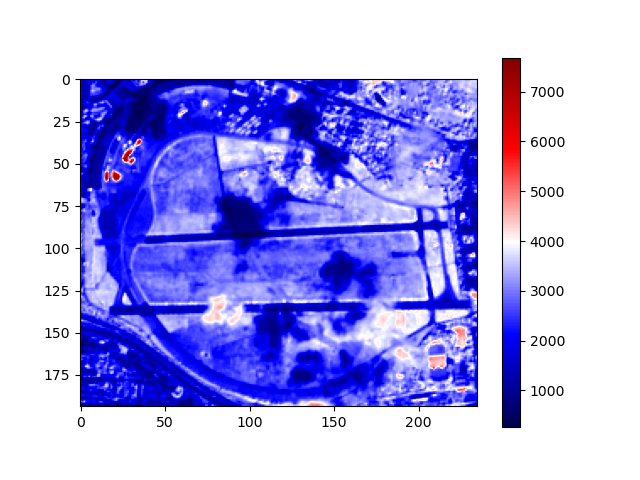

# How to use COG's (Cloud optimized GeoTIFFs) with Rasterio 

According to [Cogeo.org](https://www.cogeo.org/):

> *A Cloud Opdtimized GeoTIFF (COG) is a regular GeoTIFF file, aimed at being hosted on a HTTP file server, with an internal organization that enables more efficient workflows on the cloud. **It does this by leveraging the ability of clients issuing ​HTTP GET range requests to ask for just the parts of a file they need.***

Think about the following case: You want to analyze the [NDVI](https://de.wikipedia.org/wiki/Normalized_Difference_Vegetation_Index) of your local 1km² park by using Sentinel 2 geoTIFF imaginery. Sentinel 2 satellite images cover very big regions. In the past, you had to download the whole file (100mb +) for band 4 (red) and the whole file for band 8 (near infrared) even that in fact, you need only a small portion of the data. That's why COG's (cloud optimized geoTIFFs) have been invented. With them, we ask the server to only send specific bytes of the image.

Cloud optimized geoTIFFs offer:
- efficient imaginery data access
- reduced duplication of data
- legacy compatibility

COG's can be read just like normal geoTIFFs. In our example, we will use an AOI (area of interest), that is described in a [geoJSON](https://geojson.io/). We will also use [sat-search](https://github.com/sat-utils/sat-search) to query the latest available Sentinel-2 satellite imaginery for our specific location. Then we will use [Rasterio](https://rasterio.readthedocs.io/) to perform a range request to download only the parts of the files we need. We will also use [Pyproj](https://pyproj4.github.io/pyproj/stable/) to perform neccessary coordinate transformations. The cloud optimized Sentinel 2 imaginery is hosted in a [AWS S3 repository](https://registry.opendata.aws/sentinel-2-l2a-cogs/).

### Install libraries (matplotlib optional)
```bash
pip install rasterio pyproj sat-search matplotlib
```

### Import libraries

```python

from satsearch import Search
from datetime import datetime, timedelta
from pyproj import Transformer
from json import load

import rasterio
from rasterio.features import bounds
```

First, we need to open our geoJSON file and extract the geometry. To create a geoJSON, you can go to [geojson.io](https://geojson.io/). Do not make a very large geoJSON (a good size is 1x1km²), otherwise you might get an error later.

```python
file_path = "path/to/your/file.geojson"
with open(file_path,"r") as fp:
    file_content = load(fp)
geometry = file_content["features"][0]["geometry"]
```

We will query for images not older than 60 days that contain less than 20% clouds.

```python
# search last 60 days
current_date = datetime.now()
date_60_days_ago = current_date - timedelta(days=60)
current_date = current_date.strftime("%Y-%m-%d")
date_60_days_ago = date_60_days_ago.strftime("%Y-%m-%d")

# only request images with cloudcover less than 20%
query = {
    "eo:cloud_cover": {
        "lt": 20
        }
    }
search = Search(
    url='https://earth-search.aws.element84.com/v0',
    intersects=geometry,
    datetime=date_60_days_ago + "/" + current_date,
    collections=['sentinel-s2-l2a-cogs'],
    query=query
    )        
# grep latest red && nir
items = search.items()
latest_data = items.dates()[-1]
red = items[0].asset('red')["href"]
nir = items[0].asset('nir')["href"]
print(f"Latest data found that intersects geometry: {latest_data}")
print(f"Url red band: {red}")
print(f"Url nir band: {nir}")
```

Now we got the URLs of the most recent Sentinel 2 imaginery for our region. In the next step, we need to calculate which pixels to query from our geoTIFF server. The satellite image comes with 10980 x 10980 pixels. Every pixel represents 10 meter ground resolution. In order to calculate which pixels fall into our area of interest, we need to reproject our geoJSON coordinates into pixel row/col. With the recent Rasterio versions, we can read COGs by passing a rasterio.windows.Window (that specifies which row/col to query) to the read function. Before we can query, we need to open a [virtual file](https://rasterio.readthedocs.io/en/latest/topics/vsi.html)(urls of a hosted file):

```python
for geotiff_file in [red, nir]:
    with rasterio.open(geotiff_file) as geo_fp:
```
Then, we calculate the bounding box around our geometry and use the pyproj.Transformer to transform our geoJSON coordinates (EPSG 4326) into Sentinel Sat's EPSG 32633 projection.

```python
        bbox = bounds(geometry)
        coord_transformer = Transformer.from_crs("epsg:4326", geo_fp.crs) 
        # calculate pixels to be streamed in cog 
        coord_upper_left = coord_transformer.transform(bbox[3], bbox[0])
        coord_lower_right = coord_transformer.transform(bbox[1], bbox[2]) 
``` 

Now that we have the right coordinates, we can calculate from coordinates to pixels in our geoTIFF file using rasterio.

```python
        pixel_upper_left = geo_fp.index(
            coord_upper_left[0], 
            coord_upper_left[1]
            )
        pixel_lower_right = geo_fp.index(
            coord_lower_right[0], 
            coord_lower_right[1]
            )
        
        for pixel in pixel_upper_left + pixel_lower_right:
            # If the pixel value is below 0, that means that
            # the bounds are not inside of our available dataset.
            if pixel < 0:
                print("Provided geometry extends available datafile.")
                print("Provide a smaller area of interest to get a result.")
                exit()
```

Now we are ready for the desired range request. 

```python
        # make http range request only for bytes in window
        window = rasterio.windows.Window.from_slices(
            (
            pixel_upper_left[0], 
            pixel_lower_right[0]
            ), 
            (
            pixel_upper_left[1], 
            pixel_lower_right[1]
            )
        )
        subset = geo_fp.read(1, window=window)
```

The `subset` object contains the desired data. We can access and vizualize it with:

```python
        import matplotlib.pyplot as plt
        plt.imshow(subset, cmap="seismic")
        plt.colorbar()
```



I hope, I was able to show you how COG's work and that you are ready now to access your cloud optimized geoTIFF images in seconds compared to minutes in the past. Have a great day!

All together:

```python
from satsearch import Search
from datetime import datetime, timedelta
from pyproj import Transformer
from json import load

import rasterio
from rasterio.features import bounds

file_path = "path/to/your/file.geojson"
with open(file_path,"r") as fp:
    file_content = load(fp)
geometry = file_content["features"][0]["geometry"]

# search last 60 days
current_date = datetime.now()
date_60_days_ago = current_date - timedelta(days=60)
current_date = current_date.strftime("%Y-%m-%d")
date_60_days_ago = date_60_days_ago.strftime("%Y-%m-%d")

# only request images with cloudcover less than 20%
query = {
    "eo:cloud_cover": {
        "lt": 20
        }
    }
search = Search(
    url='https://earth-search.aws.element84.com/v0',
    intersects=geometry,
    datetime=date_60_days_ago + "/" + current_date,
    collections=['sentinel-s2-l2a-cogs'],
    query=query
    )        
# grep latest red && nir
items = search.items()
latest_data = items.dates()[-1]
red = items[0].asset('red')["href"]
nir = items[0].asset('nir')["href"]
print(f"Latest data found that intersects geometry: {latest_data}")
print(f"Url red band: {red}")
print(f"Url nir band: {nir}")

for geotiff_file in [red, nir]:
    with rasterio.open(geotiff_file) as geo_fp:
        bbox = bounds(geometry)
        coord_transformer = Transformer.from_crs("epsg:4326", geo_fp.crs) 
        # calculate pixels to be streamed in cog 
        coord_upper_left = coord_transformer.transform(bbox[3], bbox[0])
        coord_lower_right = coord_transformer.transform(bbox[1], bbox[2]) 
        pixel_upper_left = geo_fp.index(
            coord_upper_left[0], 
            coord_upper_left[1]
            )
        pixel_lower_right = geo_fp.index(
            coord_lower_right[0], 
            coord_lower_right[1]
            )
        
        for pixel in pixel_upper_left + pixel_lower_right:
            # If the pixel value is below 0, that means that
            # the bounds are not inside of our available dataset.
            if pixel < 0:
                print("Provided geometry extends available datafile.")
                print("Provide a smaller area of interest to get a result.")
                exit()
        
        # make http range request only for bytes in window
        window = rasterio.windows.Window.from_slices(
            (
            pixel_upper_left[0], 
            pixel_lower_right[0]
            ), 
            (
            pixel_upper_left[1], 
            pixel_lower_right[1]
            )
        )
        subset = geo_fp.read(1, window=window)

        # vizualize
        import matplotlib.pyplot as plt
        plt.imshow(subset, cmap="seismic")
        plt.colorbar()
        plt.show()
```
